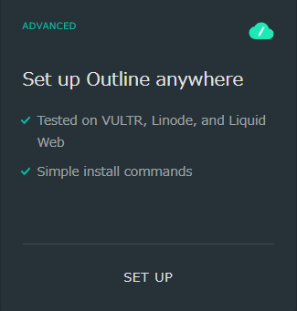
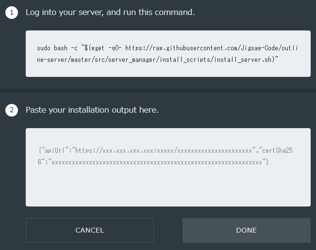
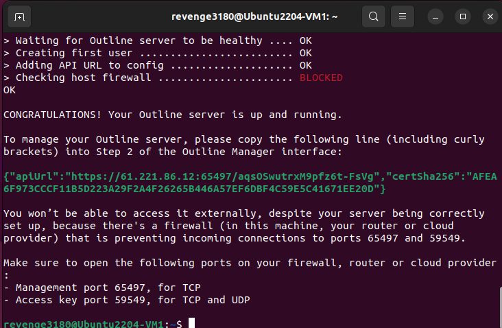
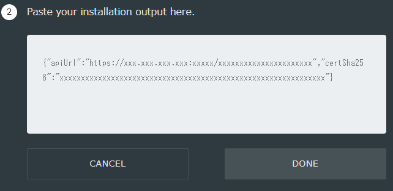

# Outline VPN

## Outline VPN support a simple method to host your own VPN server

### Preparation
Install Outline Manager first [LINK](https://getoutline.org/zh-TW/get-started/)

### Installation
```sh
sudo apt-get update
sudo apt-get install curl
```

Open Outline manager and click ```Set up Outline anywhere```


Run this command in your terminal
```sh
sudo bash -c "$(wget -qO- https://raw.githubusercontent.com/Jigsaw-Code/outline-server/master/src/server_manager/install_scripts/install_server.sh)"
```


After installation you will get a apiUrl and it will tell you which port should be open

```sh
{"apiUrl":"https://123.456.789.123:65497/aqsOSwutrxM9pfz6t-FsVg","certSha256":"AFEA6F973CCCF11B5D223A29F2A4F26265B446A57EF6DBF4C59E5C41671EE20D"}

You won’t be able to access it externally, despite your server being correctly
set up, because there's a firewall (in this machine, your router or cloud
provider) that is preventing incoming connections to ports 65497 and 59549.

Make sure to open the following ports on your firewall, router or cloud provider:
- Management port 65497, for TCP
- Access key port 59549, for TCP and UDP
```


Check IP is correct and open ports that indicated

### Configuration
Open Outline manager and paste your apiUrl, that your will have a own VPN server


