## Using PublicKey and PrivateKey to authorize user in SSH

## Introduction
Only using password to login server is very dangerous.
That means everyone just have your password, they can pretend you to do everything.
We can use PublicKey and PrivateKey to identify user

## Requirement
Client:
    OS: Windows 10/11
    Software: Putty or PuttyCAC

Server:
    OS: Ubuntu 20 or more
    Software: OpenSSH newest version

# Download and install Putty

You can down putty or puttyCAC, puttyCAC adds the ability to use the Windows Certificate API (CAPI), that can provide more authentication method, so I recommand to install it

Putty:<a href="https://www.chiark.greenend.org.uk/~sgtatham/putty/latest.html" target="_blank"> Download Site</a>

PuttyCAC:<a href="https://github.com/NoMoreFood/putty-cac/releases" target="_blank"> Download Site</a>


## How to generate key pair and put publickey to server

1. Open PuttyGen

 </img>

2.Here you can see 6 blocks

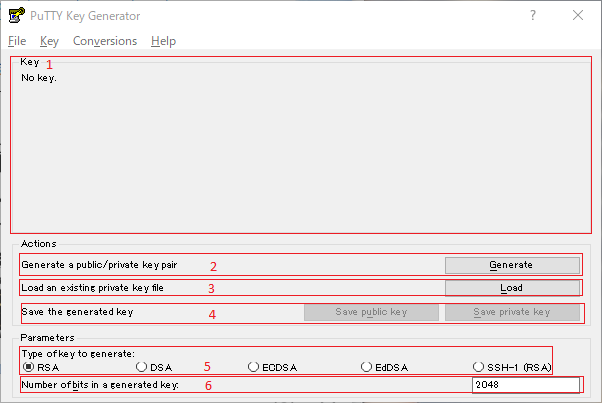 </img>

    1. Here will display publickey
    2. Here can generate key pair
    3. Here can load exist privatekey
    4. Here can save key pair
    5. Here can select what type of key will be generate (Usually select to RSA)
    6. Here can set number of bits in your key (Recommand more than 2048) 

3. Select your option and click Generate

4. Moving your mouse over blank area

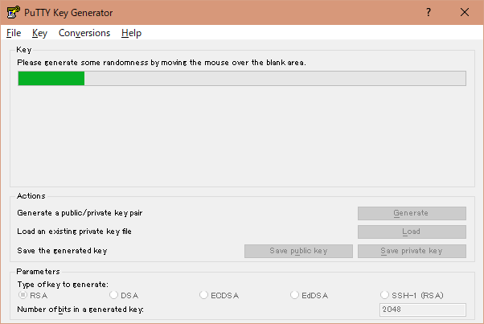 </img>

5. Key Pair have been generated

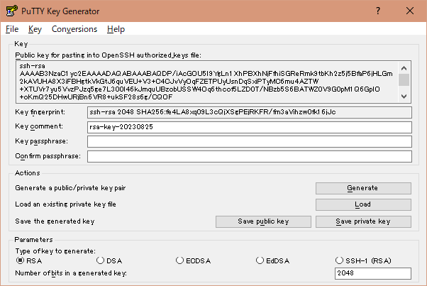 </img>


6. Edit key comment, That will help you to identify which key you want to use
7. Enter key passphrase to lock this privatekey

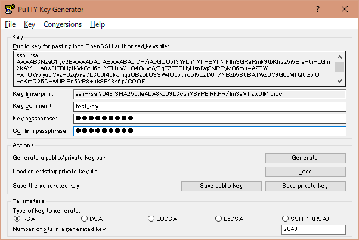 </img>


8. Save your privatekey to your safety dictionary

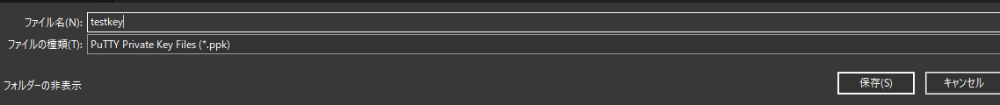 </img>


9. Copy public Key and paste a new text file

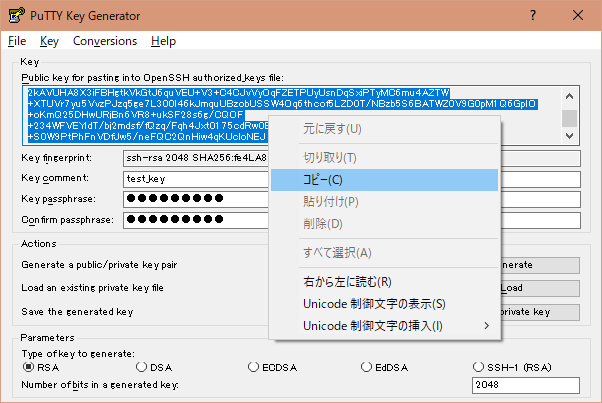 </img>

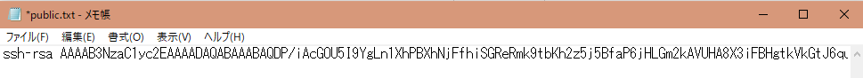 </img>

10. Connect your server

11. cd to ~/.ssh

```sh
cd ~/.ssh
```

12. Paste your public key to authorized_keys

```sh 
echo <YOUR PUBLICKEY> >> authorized_keys
```
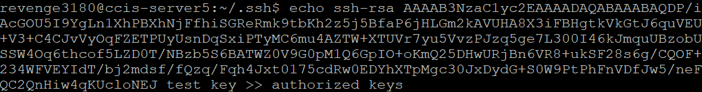 </img>


## Using PrivateKey to login server

1. Open Putty and enter IP,Port,protocol and Session Name

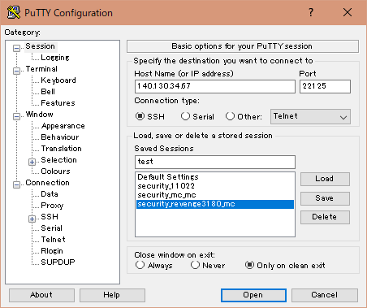 </img>

2. Click Left Nav Bar, Select Connection/Auth

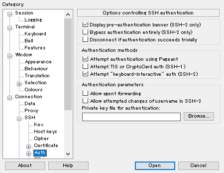 </img>

3. Browse PrivateKey

 </img>

4. Click Left Nav Bar, Select Windows/Appearance, change font size as your want

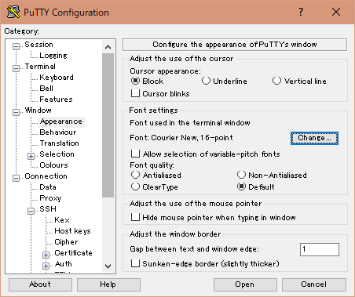 </img>

5. Click Left Nav Bar, Select Session, and click save

 </img>

## Connect to server 

Click Session name twice, then enter passparse, that you can login to server

## Advance SSH Security in server

1. login as root

2. edit /etc/ssh/sshd_config

```sh
vim /etc/ssh/sshd_config
```

3. Find PermitRootLogin set to no

```sh
PermitRootLogin no
```

4. Find PasswordAuthentication set to no

```sh
PasswordAuthentication no
```

5. Find AllowUsers and += your username

```sh
AllowUsers += username
```

6. save file and

7. Restart ssh service

```sh
systemctl restart ssh
```


