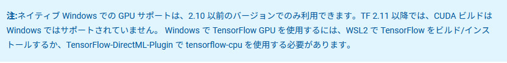
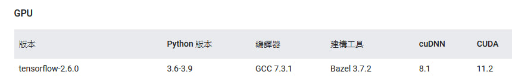
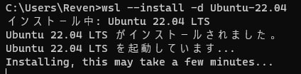
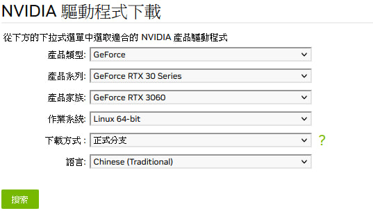
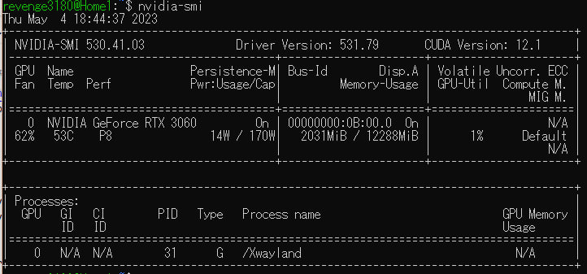
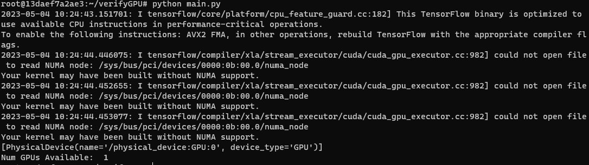

## Create enviroment for Tensorflow GPU machine Learning

NOTICE: 




## Requirement:

    Hardware:
        Nvidia Geforce 3060
    Software:    
        OS: Windows 10
        WSL Version: 2 
        WSL OS: ubuntu 22.04 LTS



## Install WSL2

1. Open Windows terminal and install wsl



```cmd
wsl --install -d Ubuntu-22.04
```

2. type username and password then you are complete wsl installation

## Install Nvidia Driver

1. Remove old driver

```sh
sudo apt-get purge nvidia*
sudo apt-get autoremove
sudo apt-get autoclean
sudo rm -rf /usr/local/cuda*
```

2. Go to <a href="https://www.nvidia.com.tw/Download/index.aspx?lang=tw" target="_blank"> Nvidia Offical Download Site</a> and find out your driver version




3. Install Driver by your version

NOTE: 530 is my version, replace it yourself

```sh
sudo apt update
sudo apt install nvidia-utils-530 -y
sudo apt install nvidia-driver-530 -y
```

4. Close WSL2 and restart install(Or restart your windows)

5. Run this command



```sh
nvidia-smi
```

Check you have successful installed


## Install Docker

1. Install Docker
```sh
curl -fsSL https://get.docker.com -o get-docker.sh
sudo sh get-docker.sh
sudo service docker start
```

2. Install nvidia docker2

```sh
distribution=$(. /etc/os-release;echo $ID$VERSION_ID) \
   && curl -s -L https://nvidia.github.io/nvidia-docker/gpgkey | sudo apt-key add - \
   && curl -s -L https://nvidia.github.io/nvidia-docker/$distribution/nvidia-docker.list | sudo tee /etc/apt/sources.list.d/nvidia-docker.list
```

```sh
sudo apt-get update
sudo apt-get install -y nvidia-docker2
```

```sh
sudo service docker restart
```

## Running Container

1. Write a docker file named Dockerfile

```sh
vim Dockerfile
```

```dockerfile
FROM tensorflow/tensorflow:latest-gpu
MAINTAINER 41043223

WORKDIR /root/verifyGPU

Env TZ=Asiz/Tokyo
Run ln -snf /usr/share/zoneinfo/$TZ /etc/localtime && echo $TZ > /etc/timezone

RUN apt update
RUN apt install vim wget git curl -y

RUN touch main.py
RUN echo "import tensorflow as tf" >> main.py
RUN echo "print(tf.config.list_physical_devices('GPU'))" >> main.py
RUN echo "print('Num GPUs Available: ', len(tf.config.list_physical_devices('GPU')))" >> main.py
```

2. Build Docker file

```sh
sudo docker build -t tf_vim:ver1.1 .
```
3. Running Container

```sh
sudo docker run -it --gpus all --name tf_test_gpu tf_vim:ver1.1 bash
```

## Verify installation


In container Run

```sh
python main.py
```

If Num GPUs Available >= 1 , that indicate you are installed successful



## Done

