##  Use Yubikey to login SSH

If you using SSH, you should know have many method to verify your login, Security Key is one of method to login server

I am using Yubico Yubikey 5 NFC and Yubico Security Key NFC for example

### Credentials

1. Non Discoverable Key
2. Discoverable Key

Benefits of Non-discoverable keys:
```
Cannot be used by another person if the YubiKey is found
Ideal for higher security systems
```
Benefits of Discoverable keys:
```
Can be taken to any compatible workstation and used to authenticate by touch and FIDO2 PIN
Ideal for ease of access where the PIN is known
```

### Requirement 

For all user:
You need install OpenSSH server version >=8.2

For Windows user:
If you want to use physical key to log in server in Putty you should install "PuTTY CAC" <a  target="_blank" href="https://github.com/NoMoreFood/putty-cac/releases">LINK</a>
i.e. Advance putty, can use more security options in windows

After your install, you can start Putty(PuTTY CAC just a addon, base on putty)

### Non-discoverable keys

#### Windows user want to use physical key to login server in Putty

1.Create and save a session (Follow Red guide)

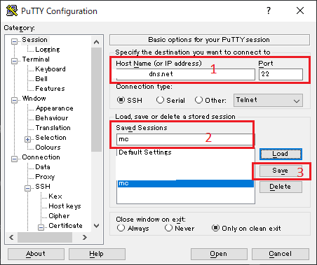 </img>

2.Find left navigation bar, select Connection/SSH/Certificate/FIDO Tools

3.Choose Algorithm to ```ssh-ed25519``` , name a Application name(Just use to identity which key, should start in ```ssh:```) , select key type and user verification

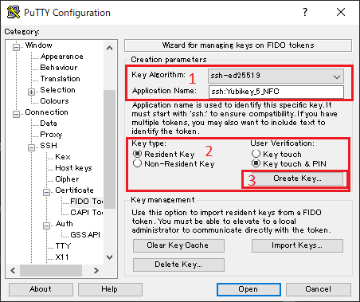 </img>

4.Choose OK

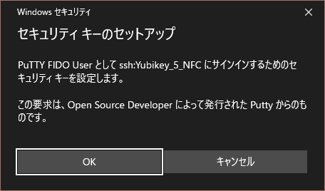 </img>

5.Choose OK

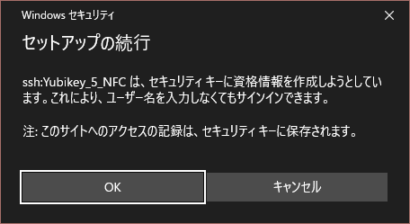 </img>

6.Enter your PIN

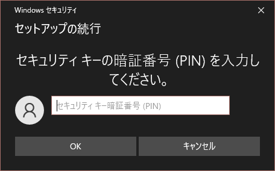 </img>

7.Touch your key

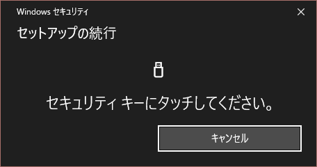 </img>

8.Select Yes(save to your session)

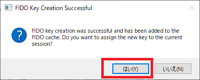 </img>

9.Find left navigation bar, select Connection/SSH/Certificate Click ```Copy to Clipboard```

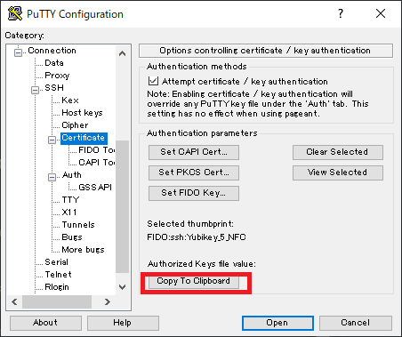 </img>
10.Find left navigation bar, select Session and save your session


11.Paste your public key(Ctrl+V) to ~/.ssh/authroized_keys 

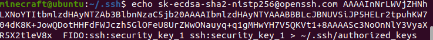 </img>

NOTICE:which user you are login, you are setting it's login method now

```sh
echo YourKey >> ~/.ssh/authorized_keys
```

#### Login 

Follow application you can log in using physical key

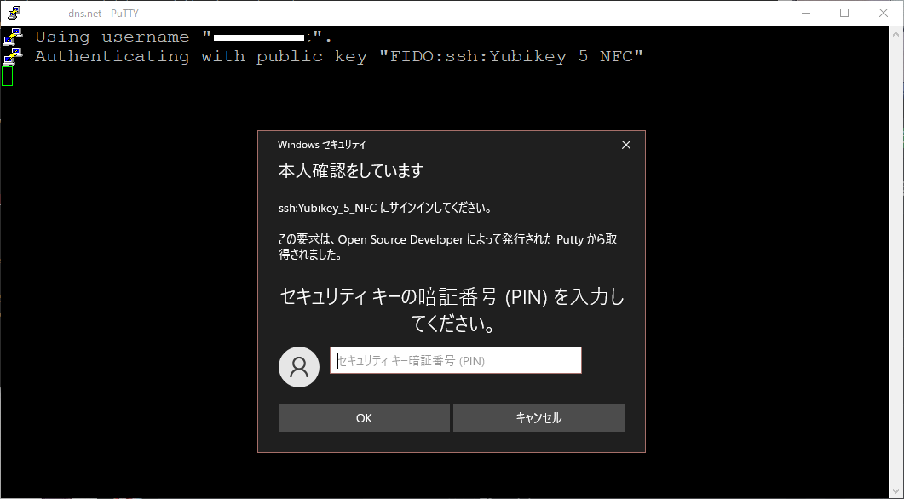 </img>
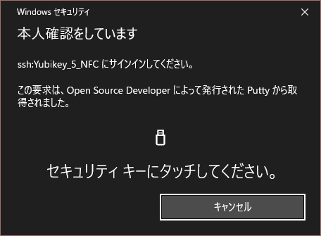 </img>

#### Use the same key in other computer

1.Create and save a session (Follow Red guide)

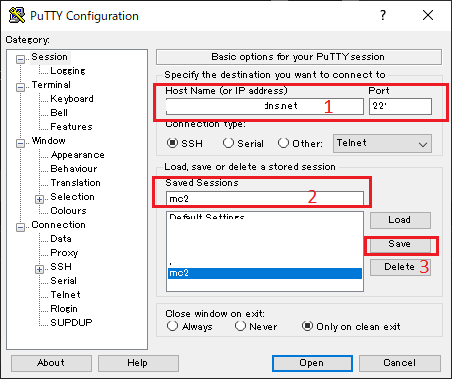 </img>

2.Find left navigation bar, select Connection/SSH/Certificate/FIDO Tools Select ```Import Keys```

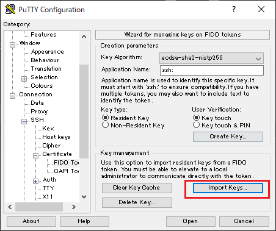 </img>

3.Choose OK

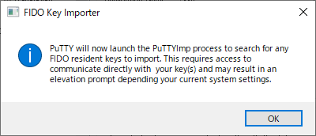 </img>

4.Enter PIN

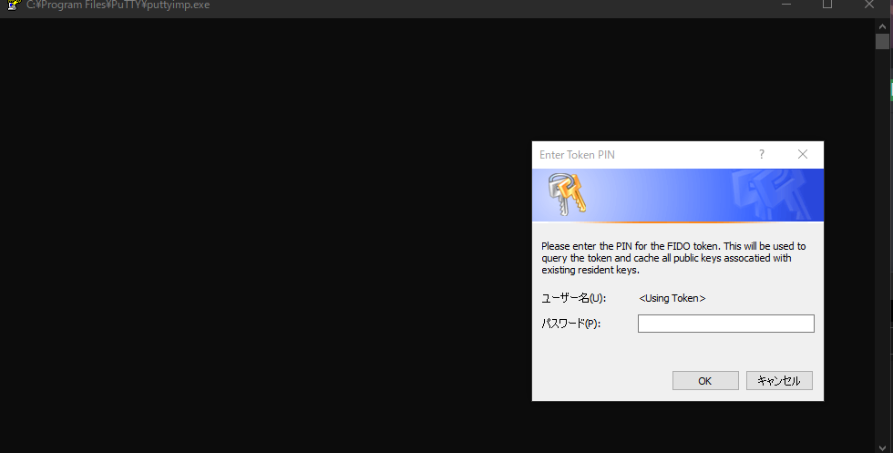 </img>

5.If you have multi key, please choose you key which you are insert

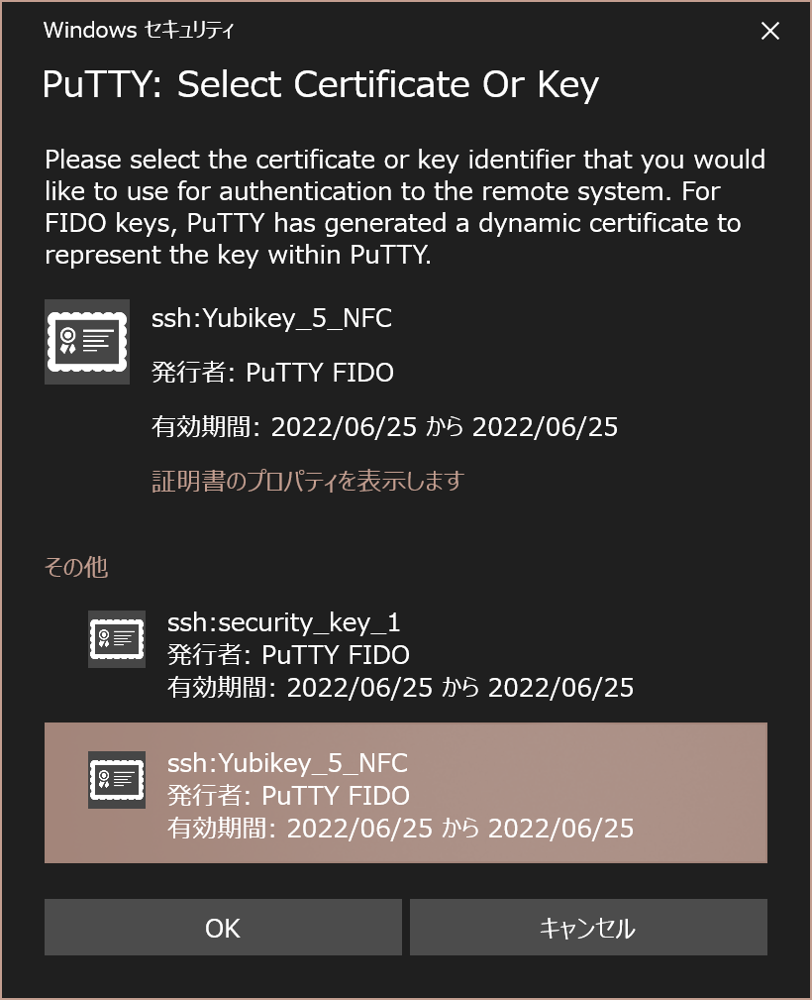 </img>

#### If you can't see other keys, click ```Others```

6.Checked import have 1 and Select OK

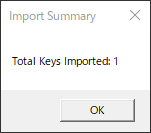 </img>

7.Find left navigation bar, select Connection/SSH/Certificate Select Set FIDO Key

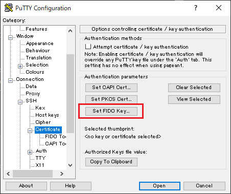 </img>

8.Find left navigation bar, select Session and save your session and you can use now

### Multi Key 

Just append public key to authorized_keys 


```echo yourkey >> ~/.ssh/authorized_keys```


### Reference:
1.<a  target="_blank" href="https://developers.yubico.com/SSH/Securing_SSH_with_FIDO2.html">Yubikey Official Document</a><br>
2.<a  target="_blank" href="https://blog.gtwang.org/windows/windows-configure-putty-ssh-with-yubico-security-key-authentication-2022/">Using Putty</a><br>
3.<a target="_blank" href="https://github.com/NoMoreFood/putty-cac/releases">PuTTY CAC</a><br>


##### Non-Resident Key

1.Create and save a session (Follow Red guide)

2.Find left navigation bar, select Connection/SSH/Certificate/FIDO Tools

3.Choose Algorithm to ```ssh-ed25519``` , name a Application name(Just use to identity which key, should start in ```ssh:```) , select key type and user verification

4.Choose OK

5.Enter your PIN

6.Touch your key

7.Select Yes(save to your session)

8.Find left navigation bar, select Connection/SSH/Certificate Click ```Copy to Clipboard```

9.Find left navigation bar, select Session and save your session

10.Paste your public key(Ctrl+V) to ~/.ssh/authroized_keys 

NOTICE: which user you are login, you are setting its login method now

```sh
echo YourKey > ~/.ssh/authorized_keys
```
11. Completed you can log in using physical key

